# Final Project

## 1. Project theme: Jenkins CI/CD process.

---
## 2. Motivation: Since my experience in DevOps practice is insignificant, I decided to do the deployment and update of the Web page on a remote server.

---
## 3. Relevant: Now this is an urgent task because it allows the developer to make changes in the project as quickly as possible and see the result.

---
## 4. Goals: Automate the process of code delivery from the developer to the server.

---
## 5. Task:

#### 1) Create an environment

#### 2) Set up working machines

#### 3) Deploy the web server

#### 4) Commit change to GitHub

#### 5) Deliver changes to a remote web server

---
## 6. Designing:

#### 1) Use 3 working machines: Windows(User), AWS_EC2_Jenkins, AWS_EC2_WebServer

#### 2) Use the GitHub repository to store our project, let's make it commit and push our project.

#### 3) Use Jenkins to manage and automate our work.

#### 4) Use AWS EC_2 service to create servers.

#### 5) Use Apache Web Server to deploy our html project.

---
## 7. Realization:

#### 1) Create repository on GitHub: "web-for-Jenkins"

#### 2) Create file our html page:

index.html
````html
<!DOCTYPE html>

<html>
    <head>
        <title>My CV V.1</title>
        <meta charset="utf-8">
        <link rel="stylesheet" href="style.css">
    </head>
    <body>
        <div class="wrapper"></div>
        <h1 class="index">Cloud&DevOps Fundamentals Autumn 2022</h1> 
        <hr>
         
        <br>
        <a href="https://github.com/alex-shveps/EPAM_Homework" target="_blank" >github repositories with home-task </a>
        <br>
        <a href="https://github.com/alex-shveps/EPAM_Homework" target="_blank" >github repositories with home-task </a>
        <br>
        <a href="https://drive.google.com/file/d/1bqw9WfrogYB7DXxvoCJPKF1ls4EwMwh6/view?usp=share_link" target="_blank"> My CV </a>
    </body>
</html>
````

style.css
````css
[href="https://github.com/alex-shveps/EPAM_Homework"] {
    color: rgb(0, 0, 0);
}

[href="https://drive.google.com/file/d/1bqw9WfrogYB7DXxvoCJPKF1ls4EwMwh6/view?usp=share_link"] {
    color: rgb(0, 0, 0);
}
body{
    background-color: rgb(74, 151, 151);
}
.wrapperERROR {
    width: 100;
    background-color: blue;
}

.index {
    text-align: center;
    color: rgb(229, 255, 0);
}

.error {
    text-align: center;
    color: rgb(255, 0, 0);
}
````

error.html
````html
<!DOCTYPE html>

<html>
    <head>
        <title>ERROR</title>
        <meta charset="utf-8">
        <link rel="stylesheet" href="style.css">
    </head>
    <body>
        <div class="wrapperERROR"></div>
        <h1 class="error">ERROR</h1>
    </body>
</html>
````
add some picture


#### 3) Clone this repository on localhost(Windows):

use PowerShell
````
git clone git@github.com:alex-shveps/web-for-Jenkins.git
git status
````


#### 4) Create 2 EC_2 instance on AWS:

Use proccesor - t2.micro
Name - Jenkins, Web
OS images - Ubuntu Server 20.04
We choose key pair
Select security group with open port: 22, 53, 80, 8080
Configure storage

#### 5) Login on AWS_EC2_Jenkins server:

Use MobaXtem for SSH connect to server
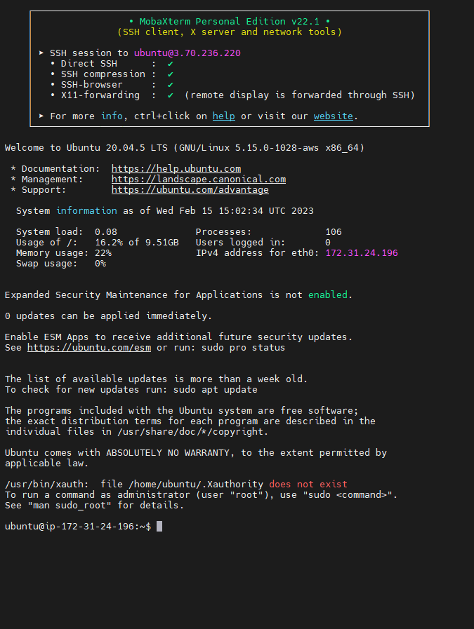

#### 6) Setup AWS_EC2_Jenkins server:

Create apt file for install Jenkins:
````
curl -fsSL https://pkg.jenkins.io/debian-stable/jenkins.io.key | sudo tee \
  /usr/share/keyrings/jenkins-keyring.asc > /dev/null

echo deb [signed-by=/usr/share/keyrings/jenkins-keyring.asc] \
  https://pkg.jenkins.io/debian-stable binary/ | sudo tee \
  /etc/apt/sources.list.d/jenkins.list > /dev/null
````

Install Java:
````
sudo apt-get update

sudo apt install openjdk-11-jre
````

Install Jenkins:
````
sudo apt-get install jenkins
````

Check status Jenkins:
````
sudo systemctl status jenkins
````
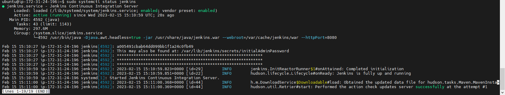

#### 7) Login on Jenkins in Web and setup:

Connect to host_ip:8080
Write password from fiel /var/lib/jenkins/secrets/initialAdminPassword
````
sudo cat /var/lib/jenkins/secrets/initialAdminPassword
````

Use standart installation plugin.
Create user with credentials
Install plagin to SSH connect 


Connect to GitHub account with SSH key
On EC2_Jenkins generait key pair
````
ssh-keygen
````
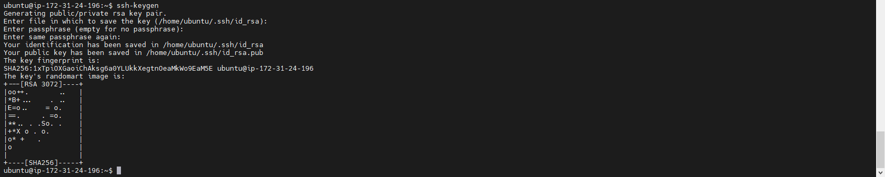

Added public key to GitHub account
````
cat .ssh/id_rsa.pub
````
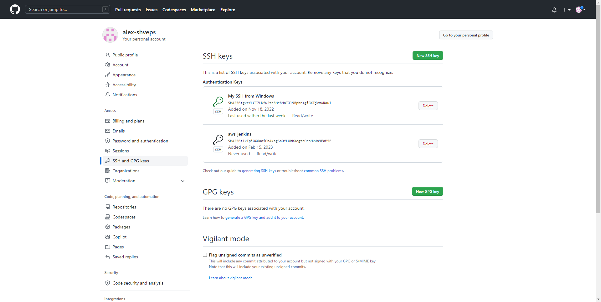

Added global credentials to SSH connect GitHub
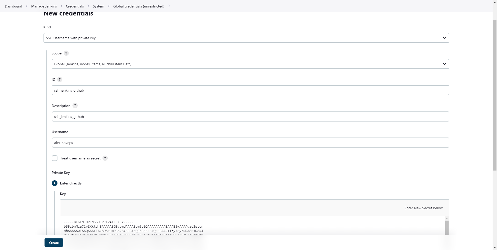 

#### 8) Login on AWS_EC2_Web server:

Use MobaXtem for SSH connect to server
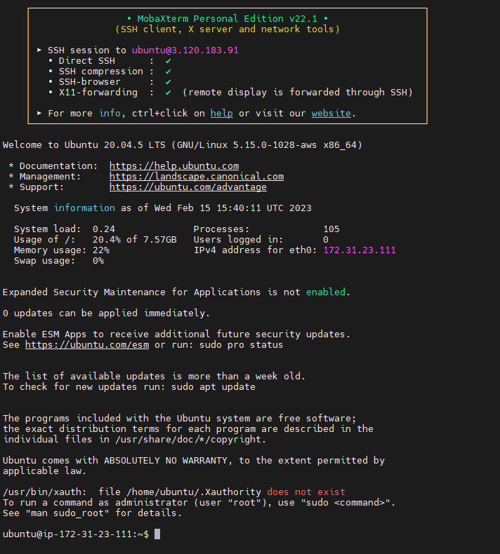

#### 9) Setup AWS_EC2_Web server:

Install Apache Web Server
 
````
sudo apt update
sudo apt install apache2
sudo ufw allow 'Apache'
sudo systemctl status apache2
````
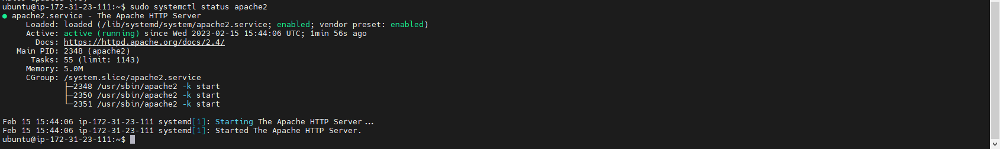

Check Web Browser
wright ip_AWS_EC2_Web


WE need to modify permission on html directory
````
sudo chmod -R 777 /var/www/
````

#### 10) Setup connect Jenkins to Web_server

Go to configuration Jenkins on Webhost
Write privat SSH key from AWS
Write instance name, ip and username
Remove directory
````
/var/www/html/
````
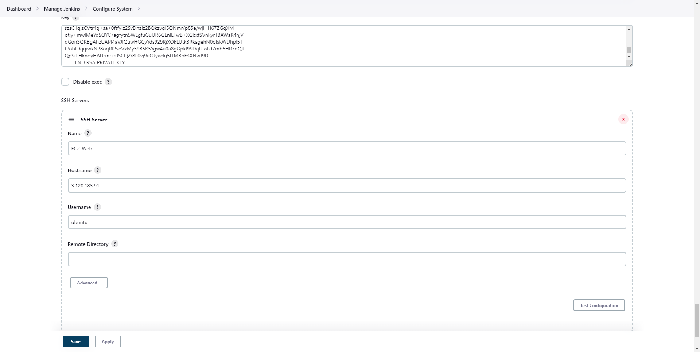

#### 11) Create new job in Jenkins

Write name job and discription
Source Code Management we choose Git and copy GitHub SSH conect link
````
git@github.com:alex-shveps/web-for-Jenkins.git
````
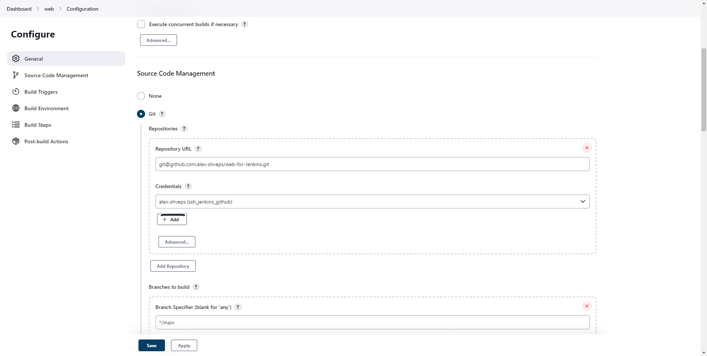

Build Triggers choose Poll SCM
Write 
````
H/2 * * * *
````
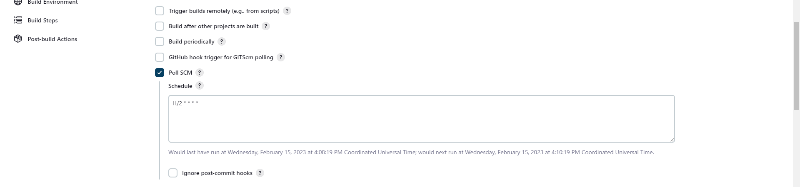

Setup SSH publisher
Choose nameserver
Source file write "*"

Exec command to restart Web_server
````
sudo systemctl restart apache2
````
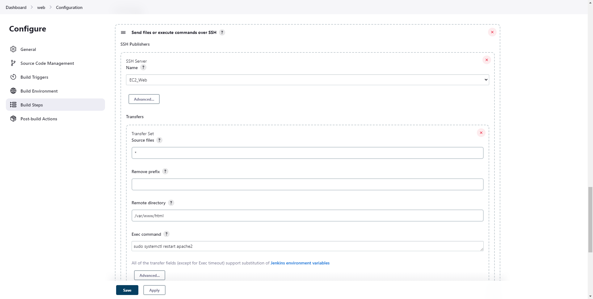

#### 12) Save and Run our Job

See console Output
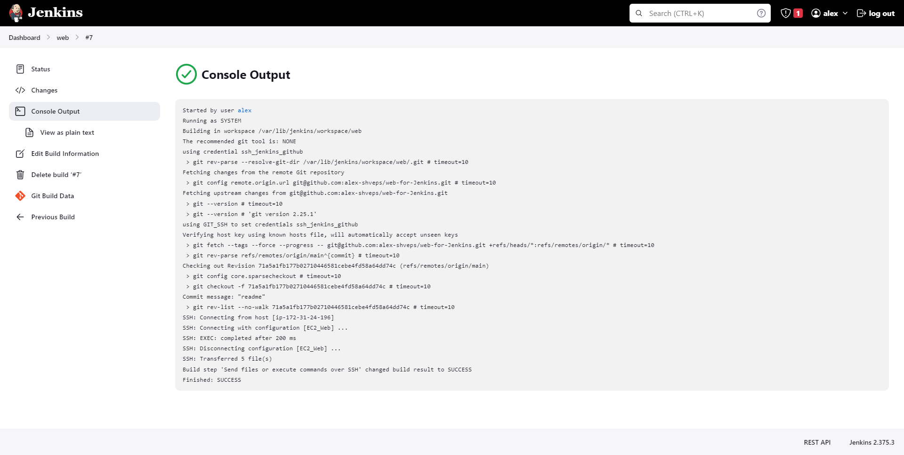

Update our Web Browser page on EC2_Web server
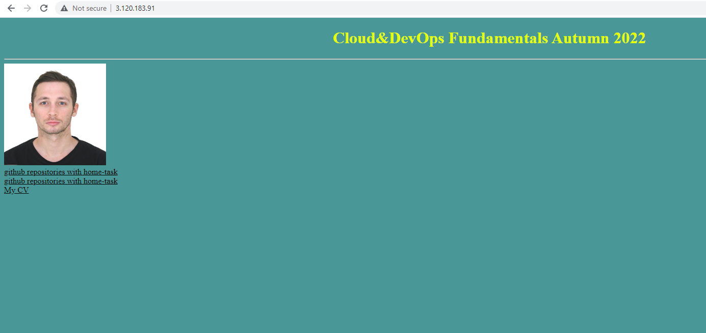

#### 13) Do commit from localhost with some change and push to GitHub

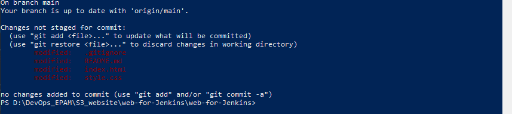
![]

